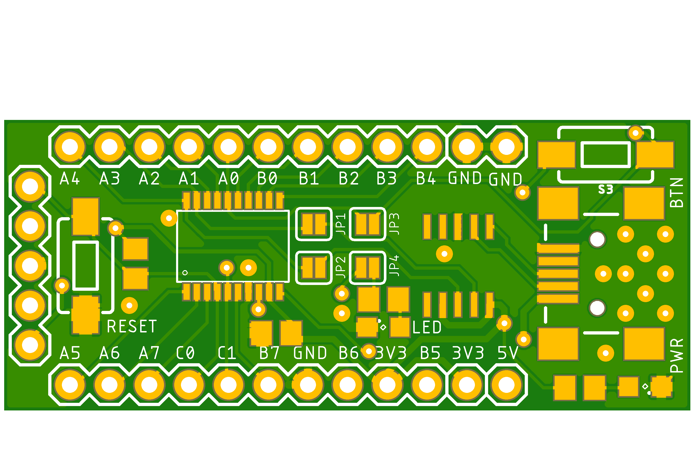
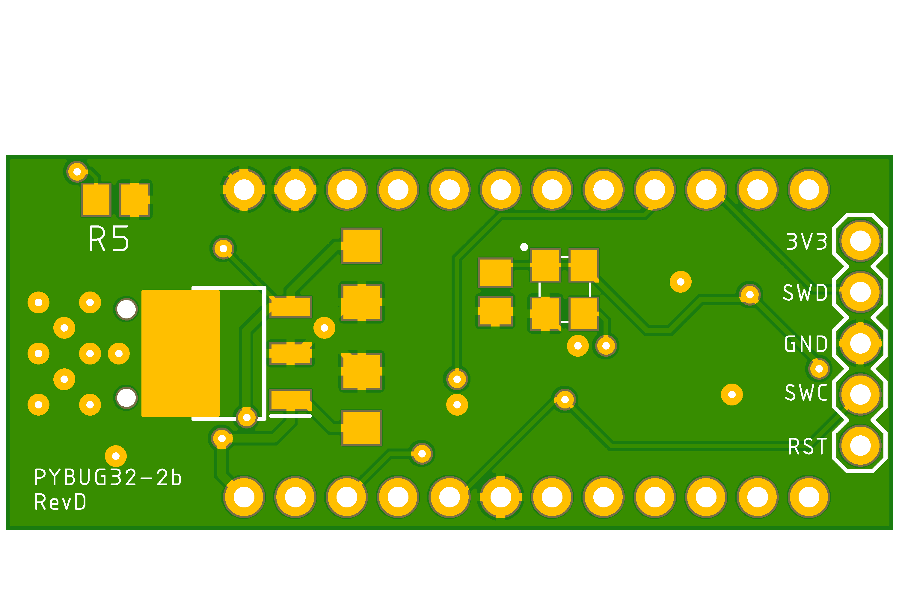

# py32f002bf15p6
Simple breakout board for py32f002bf15p6 tssop20 24MHz 24kB Flash 2kB Ram 18 IOs MCU

- 3.3v LDO powered from 5V USB.
- UART connectivity to USB via ch340 optionally connected to pins PA3/PA4 using jumpers.
- ARM SWD programming interface header.
- All other pins are broken out to headers.
- 1 LEDS optionally connected to pin PA1 using jumper.
- 1 Button with pulldown optionally connected to pin PA0 using jumper.
- 1 Button connected to RESET pin, pulled high.

<table>
  <tr>
    <td> </td>
  </tr>
  <tr>
    <td> </td>
  </tr>
</table>
