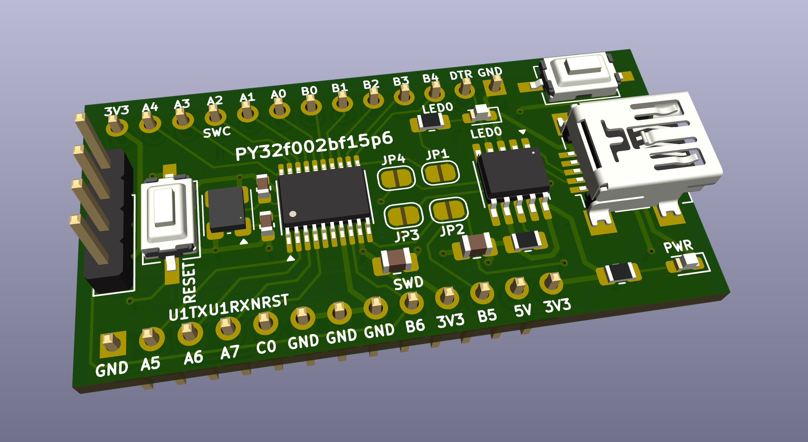
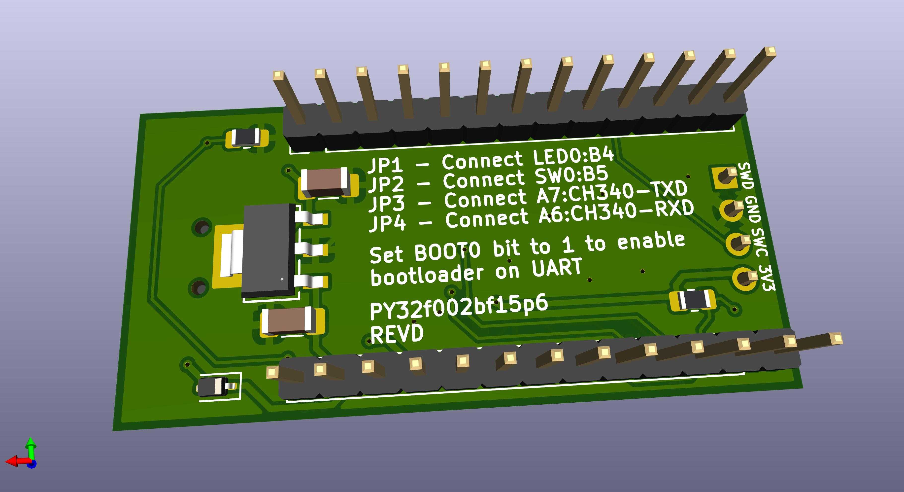
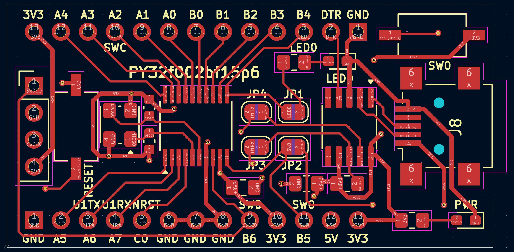
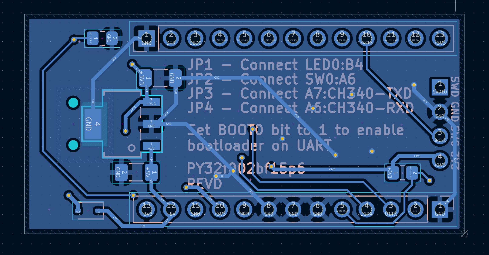

# py32f002bf15p6
Simple breakout board for py32f002bf15p6 tssop20 24MHz 24kB Flash 2kB Ram 18 IOs MCU

- 3.3v LDO powered from 5V USB.
- UART connectivity to USB via ch340 optionally connected to pins PA6/PA7 using jumpers.
- ARM SWD programming interface header.
- All other pins are broken out to headers.
- 1 LED optionally connected to pin PB4 using jumper.
- 1 Button with pulldown optionally connected to pin PB5 using jumper.
- 1 Button connected to RESET pin, pulled high.

<table>
  <tr>
    <td> </td>
    <td> </td>
  </tr>
  <tr>
    <td> </td>
    <td> </td>
  </tr>
</table>

Resources

<li>https://www.puyasemi.com/en/py32_series.html</li>
<li>https://www.eevblog.com/forum/microcontrollers/$0-11-py32f002a-m0-24mhz-320kb-actually-324kb-more-peripherals/</li>
<li>https://www.cnblogs.com/milton/p/18168592</li>
<li>https://github.com/IOsetting/py32f0-template/tree/main</li>
<li>https://www.cnblogs.com/milton/p/17111286.html</li>
<li>https://www.cnblogs.com/milton/p/18168592</li>

 

Notes - The attached firmware was written for the deprecated board produced with EAGLE, since then I have replaced the 
oscillator with a crystal and may have changed the IO pin for LED0/SW0 review the code before using it. I will update 
it when I have time.
